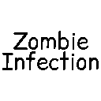

<p align="center">
  
</p>

<h1 align="center">Zombie Infection</h1>

<p align="center">
  Survival horror, infección progresiva e infectados especiales para Minecraft Fabric.
</p>

<p align="center">
  
  
  
  
  
  
</p>

> [!WARNING]
> Zombie Infection está en **desarrollo hacia 0.5.0 Beta y NO ES ESTABLE**. Esta compilación contiene únicamente la Parte 1; no es la release final de 0.5.0. No se recomienda utilizarla en mundos importantes ni en servidores de producción. Haz una copia de seguridad antes de probarla; su contenido, balance y datos pueden cambiar de forma incompatible en futuras versiones.

## Descripción

Zombie Infection transforma el Overworld en un brote zombi progresivo. El jugador puede contraer una infección persistente, sufrir síntomas cada vez más graves, extraer muestras biológicas de los infectados y producir tratamientos en un laboratorio médico.

La población hostil natural del Overworld está formada principalmente por el **Infectado común**, acompañado ocasionalmente por Runner, Bloater y Spitter. Los cuatro utilizan IA basada en SmartBrainLib, visión real, memoria temporal e investigación de ruidos; los monstruos hostiles vanilla se encuentran desactivados por defecto sin eliminar sus registros ni impedir su uso mediante comandos o contenido especial.

## Características actuales

### Infección y supervivencia — 0.5.0-dev.5

El archivo `config/zombie-infection-gameplay.properties` permite ajustar siete fuentes de contagio. Cada prefijo de la tabla tiene tres claves: `.chance` (probabilidad entre 0 y 1), `.min` y `.max` (puntos enteros de infección entre 0 y 100).

| Prefijo | Probabilidad predeterminada | Mínimo | Máximo |
|---|---:|---:|---:|
| `infection.common` | 0.20 | 5 | 10 |
| `infection.runner` | 0.30 | 8 | 15 |
| `infection.bloater` | 0.40 | 10 | 18 |
| `infection.spitter` | 0.0 | 0 | 0 |
| `infection.spitterProjectile` | 0.25 | 5 | 10 |
| `infection.spitterZone` | 0.10 | 1 | 3 |
| `infection.bloaterCloud` | 0.15 | 2 | 5 |

Estos defaults conservan los valores anteriores. El Spitter no contagiaba por melee y su IA sigue atacando a distancia; sus opciones de melee solo se aplican si se ejecuta ese ataque. El proyectil y la zona del suelo tienen ajustes independientes. El zombi vanilla conserva su 15 % y 5–12 puntos.

Ejemplo: `infection.runner.chance=0.15`, `infection.runner.min=4` y `infection.runner.max=8`. Usa `/infection config reload` como operador para aplicar los cambios. Las nubes que ya existen también consultan los valores activos. Su categoría se guarda al descargar chunks o cerrar el mundo.

Los valores finitos de infección fuera del rango se limitan automáticamente; los mínimos/máximos invertidos se ordenan. Texto inválido, decimales en cantidades, NaN, infinito y claves desconocidas rechazan la recarga completa y conservan los ajustes válidos anteriores. Los controles de spawn conservan sus rangos estrictos de dev.4. Una clave ausente usa su default; al iniciar se añaden las claves faltantes al archivo válido existente, conservando sus comentarios y valores personalizados.

- **Feedback discreto:** contagio aplicado, exposición bloqueada y tratamientos aparecen en la barra de acción. Los avisos automáticos se limitan a uno cada 2 segundos por jugador. Los tratamientos exitosos tienen prioridad; no se acumulan mensajes de contagio en el chat.
- **Medicinas:** Cura y antivirales no se consumen con infección 0. Una reducción mayor que la infección restante llega a 0. Cada medicina aplicada tiene 1 segundo de cooldown para evitar usos accidentales repetidos.
- **Adrenalina:** conserva Speed I por 45 segundos y Strength I por 15. No consume otra dosis mientras ambos efectos conserven más de 9 y 3 segundos respectivamente; se consideran también efectos de mayor potencia y duración infinita.
- **Supresor:** protege durante 180 segundos y no cura infección previa. Rechaza otra dosis mientras queden más de 30 segundos. Durante esos últimos 30 segundos puede renovarse hasta 180, sin sumar duraciones. `/infection` muestra infección y segundos de protección restantes. La expiración persiste en el servidor y usa el reloj global del Overworld; transcurre mientras el servidor avanza, incluso si el jugador está desconectado.
- **Outbreak:** un mensaje breve de chat anuncia el primer cruce de los niveles 1–4. Solo se guarda el máximo nivel anunciado en el Overworld; la fase actual sigue derivándose del día. Al instalar en un mundo avanzado se establece una referencia silenciosa. Reinicios, logins o retrocesos de hora no repiten avisos; un salto de varios niveles anuncia solo el nivel alcanzado.
- **`/infection outbreak`:** una línea muestra día (misma cuenta desde 0), número y nombre de fase, multiplicadores activos de día/noche, límites efectivos y aparición natural activada/desactivada. De día muestra los tres multiplicadores: común, Runner y especiales.
- **Casas iluminadas:** se mantiene `maximumBlockLight=7`. La comprobación usa luz artificial en el punto de aparición; la luz solar permite aparición exterior durante día y noche. No existe una zona de protección arbitraria alrededor de las antorchas.
- **Clínica/farmacia:** conservan materiales útiles y una sola tirada de loot raro. Kit 8 %/6 %, antiviral básico 5 %/7 %, inyección 1 %/1 % por cofre; Cura ausente. La muestra antigua se sustituye por tejido/sangre utilizables en el laboratorio, sin aumentar las probabilidades de medicina.

La validación de dev.5 usa `tools/ValidateSurvivalConfig.java` y los GameTests filtrados de `SurvivalGameTests`. La comprobación de reinicio se activa con `-Dzombie-infection.verifyOutbreakRestart=true` y se ejecuta después de `survivalPolish` contra el mismo directorio aislado; fuera de ese modo no exige un mundo de prueba previo. Los resultados y comandos de esta entrega están en `run/zi_dev5_survival/`.

### Sistema de infección

- Infección de **0 a 100 %**, persistente al salir y volver a entrar al mundo.
- Cinco estados visibles: sano, expuesto, infección temprana, moderada y grave.
- Síntomas progresivos desde el 25 %: hambre, debilidad, náuseas, lentitud y daño en fases avanzadas.
- Muerte al alcanzar el 100 % de infección.
- Lógica autoritativa en el servidor y datos sincronizados con el cliente.
- HUD compacto con porcentaje y avisos de cambio de etapa.
- Monitor epidemiológico compacto con estado, tratamiento y telemetría del brote.
- Acceso rápido al monitor con la tecla **I** o desde el inventario.

### Infectado común y variantes especiales

| Infectado | Comportamiento | Amenaza especial |
| --- | --- | --- |
| **Infectado común** | Enemigo habitual, melee, velocidad moderada y memoria breve | Contagio del 20 %, de 5 a 10 puntos por golpe válido |
| **Runner** | Muy rápido, audición alta, persecución agresiva y memoria corta | Cierra distancias rápidamente y puede transmitir infección con sus golpes |
| **Bloater** | Lento, resistente, difícil de desplazar y persistente | Libera una nube infecciosa temporal al morir |
| **Spitter** | Combate a distancia, mantiene espacio y se reposiciona | Dispara un proyectil infeccioso que crea una pequeña zona contaminada al impactar |

Los cuatro infectados:

- detectan jugadores mediante visión con line of sight real;
- recuerdan temporalmente la última posición observada;
- pierden al objetivo cuando consigue escapar;
- investigan ruidos cercanos y regresan a patrullar si no encuentran nada;
- no se atacan entre sí como objetivos normales;
- cuentan con huevos generadores y loot propio.

El Spitter comprueba orientación frontal, distancia, visión y cooldown antes de cada disparo. Su rango máximo es de aproximadamente 14 bloques y genera un solo proyectil por ataque.

El Infectado común (`zombie-infection:infected`) tiene 20 de vida, velocidad 0.24, daño 3, seguimiento de 32 bloques, armadura 0 y resistencia al empuje 0. Su audición máxima es de 26 bloques con sensibilidad 0.90. Recuerda al jugador durante 4 segundos e investiga ruidos durante un máximo de 8. Reutiliza el cerebro común, actualizando el destino de persecución cada 10 ticks. Tiene textura original, huevo generador y loot de 0–1 de carne podrida; no genera materiales de extracción por su loot normal.

Ningún infectado del mod se quema automáticamente al sol. Desde dev.3 los cuatro tipos pueden aparecer naturalmente con luz solar en el Overworld. La luz de bloques debe ser de 0–7; las zonas con iluminación artificial de 8 o más impiden nuevas apariciones. Se exige suelo válido sin hojas, espacio para toda la entidad, ausencia de líquidos y colisiones, borde del mundo válido y ningún jugador vivo no espectador a menos de 24 bloques. El sistema natural de Minecraft sigue aplicando su presupuesto, distancias y comprobaciones adicionales. Se mantiene el despawn normal y la desaparición en Pacífico.

La fase diurna ocupa los ticks 0–11999 de cada día; la nocturna, 12000–23999. De día, la probabilidad de aceptación de Outbreak se multiplica por 0.55 para comunes, 0.35 para Runner y 0.20 para Bloater/Spitter. De noche el multiplicador es 1.0 para los cuatro. Esto cambia probabilidades por intento, no garantiza una cantidad de mobs: grupos, terreno, luz artificial y límites locales siguen influyendo. Se conservan los pesos, densidades y límites de la tabla de Outbreak.

### Ruido y percepción

Los infectados reaccionan actualmente a:

- jugadores corriendo;
- bloques rotos;
- explosiones.

También existe una API preparada para futuros disparos normales y con silenciador. Las armas todavía no forman parte de esta versión.

### Outbreak Level

El nivel del brote se calcula a partir de los días transcurridos en el Overworld. Cada etapa modifica tanto la densidad total como la composición de infectados.

| Nivel | Desde el día | Común | Runner | Bloater | Spitter | Densidad | Límite total | Límite especiales |
| ---: | ---: | ---: | ---: | ---: | ---: | ---: | ---: | ---: |
| 0 — Contenido | 0 | 92 | 5 | 2 | 1 | 22 % | 12 | 1 |
| 1 — Emergente | 3 | 86 | 8 | 3 | 3 | 32 % | 18 | 2 |
| 2 — En propagación | 7 | 78 | 12 | 5 | 5 | 46 % | 24 | 3 |
| 3 — Grave | 15 | 70 | 16 | 7 | 7 | 62 % | 32 | 5 |
| 4 — Crítico | 30 | 62 | 20 | 9 | 9 | 78 % | 40 | 7 |

Los cuatro valores de composición son pesos relativos, no porcentajes garantizados de entidades: los grupos, las comprobaciones vanilla y los límites también intervienen. Los grupos naturales son de 1–4 comunes, 1–2 Runners, 1 Bloater y 1 Spitter. El límite local cuenta todos los infectados del mod en un AABB que se extiende 48 bloques horizontalmente y 24 verticalmente desde el bloque de intento (aproximadamente 97 × 49 × 97). Los especiales tienen además su propio máximo, de forma que dejan presupuesto para comunes. La consulta se realiza después del filtro de probabilidad y deja de recoger entidades al alcanzar el límite total. Los comandos y huevos generadores no están sujetos a estos límites; las entidades que crean sí cuentan para futuros intentos naturales.

### Extracción, loot y materiales

- El **Kit de extracción** tiene 32 usos y permite obtener tejido infectado o muestras de sangre al eliminar criaturas compatibles.
- El Infectado común es compatible con el kit: 60 % de éxito; en una extracción exitosa, 65 % de tejido y 35 % de sangre. El loot y la extracción son independientes.
- Runner puede soltar una **glándula suprarrenal**.
- Bloater puede soltar un **saco de toxinas**.
- Spitter puede soltar una **enzima reactiva**.
- Los materiales especiales utilizan loot tables normales y admiten Looting de forma limitada.
- La extracción con kit y el loot propio de cada infectado son sistemas separados.

### Laboratorio médico

El laboratorio es un bloque funcional con inventario persistente, slots filtrados, progreso de producción, salida protegida e integración opcional con REI.

| Producción | Material principal | Reactivo | Catalizador |
| --- | --- | --- | --- |
| Extracto viral | Tejido o sangre infectada | Redstone | Botella de vidrio |
| Compuesto antiviral | Extracto viral | Azúcar | Botella de miel |
| Antiviral básico | Compuesto antiviral | Zanahoria dorada | Botella de vidrio |
| Inyección antiviral | Antiviral básico | Lingote de hierro | Lágrima de ghast |
| Cura | Inyección antiviral | Manzana dorada | Lágrima de ghast |
| Inyector de adrenalina | Glándula de Runner | Azúcar | Botella de vidrio |
| Supresor de infección | Saco de Bloater | Enzima de Spitter | Botella de miel |

Tratamientos disponibles:

- **Antiviral básico:** reduce 15 puntos de infección.
- **Inyección antiviral:** reduce 35 puntos.
- **Cura:** elimina por completo la infección.
- **Inyector de adrenalina:** otorga Speed I durante 45 segundos y Strength I durante 15 segundos; no cura la infección.
- **Supresor de infección:** evita temporalmente nuevas aplicaciones de infección durante 3 minutos; no elimina la infección existente.

### Mundo

- Generación natural mayoritariamente de Infectados comunes, con Runner, Bloater y Spitter como variantes especiales en biomas del Overworld.
- Hostiles vanilla naturales desactivados por defecto en el Overworld.
- Animales, aldeanos, peces, criaturas ambientales y mobs neutrales permanecen habilitados.
- Nether y End conservan su comportamiento normal.
- **Clínicas abandonadas** y **farmacias abandonadas** con loot médico y materiales útiles, distribuidas con una frecuencia apta para exploración normal.
- Soporte de idioma para inglés, español y español de México.

Los cambios de distribución de estructuras solo se aplican a chunks que todavía no se hayan generado. En un mundo existente, explora terreno nuevo o utiliza `/locate structure zombie-infection:abandoned_clinic` y `/locate structure zombie-infection:abandoned_pharmacy` para confirmar el registro y buscar candidatos.

## Compatibilidad y requisitos

| Componente | Requisito |
| --- | --- |
| Minecraft | **1.21.8** |
| Java | **21 o superior** |
| Fabric Loader | **0.19.3 o compatible** |
| Fabric API | **0.136.1+1.21.8 o compatible** |
| SmartBrainLib | **1.16.10 incluido dentro del JAR de Zombie Infection** |
| Roughly Enough Items | Opcional, recomendado para consultar las recetas del laboratorio |

SmartBrainLib no necesita descargarse por separado: la compilación compatible utilizada por el mod está anidada en el JAR. REI solo funciona como visor de recetas y no es necesario para que el laboratorio produzca objetos.

Zombie Infection debe instalarse tanto en el cliente como en el servidor dedicado. REI puede instalarse únicamente en los clientes que quieran utilizar su visor.

## Instalación

1. Instala [Fabric Loader](https://fabricmc.net/use/installer/) para Minecraft 1.21.8.
2. Descarga e instala [Fabric API](https://modrinth.com/mod/fabric-api).
3. Descarga Zombie Infection desde la sección de [Releases](https://github.com/worddevs/Zombie-Infection/releases) o compílalo desde el código fuente.
4. Coloca los JAR de Zombie Infection y Fabric API en `.minecraft/mods`.
5. Opcionalmente, instala [Roughly Enough Items](https://modrinth.com/mod/rei) y sus dependencias para consultar las recetas.
6. Inicia Minecraft con el perfil de Fabric.

En un servidor dedicado, repite la instalación dentro de la carpeta `mods` del servidor y utiliza Java 21.

## Controles

| Acción | Tecla predeterminada |
| --- | --- |
| Abrir el monitor de infección | **I** |

La tecla puede cambiarse desde el menú normal de controles de Minecraft. El monitor también dispone de un botón en las pantallas de inventario y creativo.

## Comandos

| Comando | Permiso | Función |
| --- | ---: | --- |
| `/infection` | Jugador | Consulta la infección propia y los segundos restantes de supresor |
| `/infection set <player> <0-100>` | Nivel 2 | Establece la infección de un jugador |
| `/infection add <player> <amount>` | Nivel 2 | Añade infección a un jugador |
| `/infection clear <player>` | Nivel 2 | Elimina la infección de un jugador |

## Configuración del servidor

En el primer inicio se crea `config/zombie-infection-spawns.properties`:

```properties
allowVanillaHostileSpawns=false
spawnVanillaZombies=false
spawnSkeletons=false
spawnCreepers=false
```

Con `allowVanillaHostileSpawns=false`, los monstruos vanilla no aparecen naturalmente en el Overworld. Al establecerlo en `true`, los otros tres valores permiten controlar por separado las familias de zombies, skeletons y creepers. Reinicia el servidor después de editar el archivo.

La configuración no elimina EntityTypes: `/summon`, spawners, estructuras y otros mods pueden seguir utilizando entidades vanilla.

## Compilar desde el código fuente

Clona el repositorio:

```bash
git clone https://github.com/worddevs/Zombie-Infection.git
cd Zombie-Infection
```

En Windows:

```powershell
.\gradlew.bat clean build
```

En Linux o macOS:

```bash
./gradlew clean build
```

El JAR remapeado se genera en `build/libs/`. El proyecto ya contiene la dependencia compatible de SmartBrainLib utilizada para construir y empaquetar el mod.

Las regresiones de la Parte 1 están en `src/gametest` y no se incluyen en el JAR. Se ejecutan opcionalmente con `gradlew -Pgametest -PwithoutRei runGameTest`, en `build/run/gameTest`, después de colocar allí un `eula.txt` aceptado para el servidor de pruebas. Comprueban pesos y límites de población, audición real a ambos lados de sus límites, aritmética de infección con un jugador simulado, sol y Pacífico. El resultado se escribe en `build/gametest-results.xml`. El balance de combate y aparición natural sigue requiriendo pruebas manuales.

La textura del común y su huevo son arte original reproducible con `java tools/GenerateInfectedTextures.java` desde la raíz del repositorio.

## Reportar errores

Utiliza [GitHub Issues](https://github.com/worddevs/Zombie-Infection/issues) e incluye:

1. versión de Zombie Infection, Minecraft, Fabric Loader y Fabric API;
2. lista de mods instalados;
3. pasos exactos para reproducir el problema;
4. `latest.log` o crash report completo;
5. capturas o video cuando ayuden a entender el fallo.

## Contribuciones

Las contribuciones son bienvenidas. Para cambios de código:

1. crea un fork del repositorio;
2. abre una rama descriptiva;
3. mantén el cambio limitado a un objetivo;
4. ejecuta `gradlew clean build`;
5. abre un Pull Request explicando el comportamiento anterior, el nuevo y cómo se validó.

## Configuración y herramientas de partida — 0.5.0-dev.4 BETA

Los valores predeterminados mantienen el balance de dev.3. Al iniciar el mod se crea `config/zombie-infection-gameplay.properties` en la instalación que aloja el mundo. En multijugador manda el archivo del servidor; el archivo del cliente no puede modificar las reglas de un servidor ajeno.

| Ajuste de gameplay | Predeterminado | Rango / función |
|---|---:|---|
| `naturalSpawning` | `true` | Activa/desactiva nuevos spawns naturales; no elimina entidades existentes ni impide summon/huevos |
| `densityMultiplier` | `1.0` | 0–2; probabilidad final limitada a 1 |
| `dayCommonMultiplier` | `0.55` | 0–1 |
| `dayRunnerMultiplier` | `0.35` | 0–1 |
| `daySpecialMultiplier` | `0.20` | 0–1; Bloater y Spitter |
| `nightMultiplier` | `1.0` | 0–1.5 |
| `totalCapMultiplier` | `1.0` | 0.25–2; escala el límite Outbreak y redondea hacia arriba, máximo 80 |
| `specialCapMultiplier` | `1.0` | 0–2; máximo 14 y nunca más que el límite total; 0 bloquea nuevos especiales naturales |
| `minimumPlayerDistance` | `24` | 24–64 bloques |
| `maximumBlockLight` | `7` | 0–15; solo luz artificial, no solar |

- `/infection config reload`: recarga este archivo de gameplay. Requiere permiso de operador nivel 2.
- `/infection config show`: muestra los ajustes activos y los límites efectivos del nivel actual. Requiere operador nivel 2.
- `/infection outbreak`: consulta pública del nivel de brote del Overworld, día/fase y límites locales efectivos. El monitor conserva la tabla base de Outbreak y remite a este comando para los ajustes del servidor.
- La configuración antigua `zombie-infection-spawns.properties` de hostiles vanilla sigue requiriendo reinicio y no forma parte de esta recarga.

Las barras tienen un archivo independiente: `config/zombie-infection-healthbars.properties`, local a cada jugador. Se recarga con `/infectionhud reload`, sin permisos de operador.

| Ajuste visual | Predeterminado | Rango / función |
|---|---:|---|
| `enabled` | `true` | Activar/desactivar barras |
| `range` | `16` | 4–16 bloques |
| `scale` | `1.0` | 0.65–1.5 respecto al tamaño compacto |
| `damageSeconds` | `3.0` | 0–6 segundos; 0 permite verlas solo al apuntar, más el desvanecimiento |
| `fadeSeconds` | `0.25` | 0.05–1 segundo |
| `damageFlash` | `true` | Flash breve de daño |
| `damageTrail` | `true` | Franja de pérdida de vida |

El apuntado usa un único objetivo por tick del cliente mediante una consulta local de hasta 16 bloques, compartida por los cuatro renderers. Respeta paredes y entidades interpuestas, evitando seleccionar simultáneamente infectados alineados. Los infectados dañados pueden mostrar su barra independientemente del objetivo. No hay búsquedas globales ni I/O de configuración durante el render.

Ambos archivos tienen comentarios y validación estricta. Una clave desconocida, un valor fuera del rango o un archivo ilegible rechaza la recarga completa y conserva la última configuración válida. Los archivos existentes no se sobrescriben. Las claves omitidas utilizan los valores predeterminados; no heredan valores de recargas anteriores.

## Barras y aparición diurna — 0.5.0-dev.3 BETA

- Barra compacta con panel oscuro semitransparente, borde fino, nombre y HP junto a la barra. Colores suaves según la proporción real de vida: normal por encima del 60 %, advertencia por encima del 30 %, crítico hasta el 30 %.
- Anclaje sobre la altura real de la entidad o su modelo escalado, con 0.14 bloques de separación bajo el panel. Escala fija en el mundo, independiente de GUI Scale y sin amplificación al acercarse.
- Visibilidad inmediata al apuntar o recibir daño detectado por el cliente; 3 segundos tras el daño y desvanecimiento de 0.25 segundos al perder ambos motivos. Máximo 16 bloques del jugador y la cámara; obstáculos, invisibilidad, muerte y F1 ocultan inmediatamente la barra.
- Flash de daño de 0.15 segundos y una franja breve de pérdida de HP. Vida y máximo leídos de la entidad, incluidos modificadores; cifras fraccionarias mostradas con un decimal. Estado visual temporal, sin paquetes de red nuevos ni escaneos globales.
- Aparición diurna para los cuatro infectados con las restricciones descritas arriba. Atributos, IA, loot y menú se conservan.

## Gameplay polish — 0.5.0-dev2 BETA

- Tooltips de 1–3 líneas para materiales, Extraction Kit y tratamientos en inglés y español. El kit indica las extracciones exitosas restantes y muestra un aviso breve de éxito o fallo en la barra de acción.
- Barras de vida pequeñas para los cuatro infectados: nombre localizado, vida real y máximo real. Solo aparecen a un máximo de 16 bloques del jugador y la cámara, al apuntar al infectado o durante 3 segundos después de recibir daño. Se ocultan con obstáculos, invisibilidad o F1. Un flash discreto dura 0.3 segundos tras el daño.
- Common conserva su loot de 0–1 de carne podrida. Runner tiene 25 % de soltar una glándula (34 % con Looting III); Bloater, 18 % de soltar un saco (24 % con Looting III); Spitter, 20 % de soltar una enzima (26 % con Looting III). Siempre se obtiene como máximo una unidad del material especial. Las probabilidades tienen esos topes también con niveles superiores de Looting.
- Los infectados del mod ya no generan armas o armaduras vanilla aleatorias al aparecer, ni cabezas de zombie por explosiones de creepers cargados. Los objetos suministrados explícitamente o recogidos conservan sus reglas normales. Tejido y sangre siguen perteneciendo al sistema independiente de extracción.
- Se conservan los atributos base: Common 20 HP / velocidad 0.24; Runner 16 HP / 0.32; Bloater 40 HP / 0.18; Spitter 20 HP / 0.23. La barra respeta modificadores reales de atributos; no sustituye estos valores por constantes.
- El menú indica BETA / EN DESARROLLO en el espacio de subtítulo existente. La versión continúa siendo de desarrollo y la interfaz es provisional.

## Desarrollo 0.5.0 — Parte 1

- Infectado común real, con IA compartida, recursos originales, loot, extracción y spawn egg.
- Nueva composición Outbreak y límites separados para población total y especiales.
- Protección solar para los cuatro infectados del mod, sin modificar el zombie vanilla.
- Hitbox del monitor basada en el botón actual tras resize/reinit, sin acumular listeners.
- Apertura y cierre del monitor con la tecla configurada; Escape conserva su función.
- Aritmética de infección en `long` antes del clamp a 0–100.
- Radio de consulta de ruido calculado a partir de los perfiles reales de audición.
- Sin armas, hordas, nuevos especiales ni rediseño de interfaces en esta parte.

## Cambios de la versión 0.4.0

- Monitor de infección oscuro y adaptable, separado del inventario vanilla y compatible con interfaces de otros mods.
- Menú principal tematizado como red de cuarentena, conservando los botones y acciones de Minecraft y Mod Menu.
- Regreso correcto al inventario de supervivencia o creativo después de cerrar el monitor.
- Eliminación del listener de ratón duplicado del botón de acceso médico.
- Límite local progresivo para impedir acumulaciones masivas de infectados especiales.
- Grupos naturales más pequeños y composición inicial con menos predominio de Runners.
- Clínicas y farmacias abandonadas considerablemente más fáciles de encontrar durante exploración normal.
- Estado Outbreak ampliado con información sobre el protocolo de contención local.
- Recursos y traducciones revisados en inglés, español y español de México.

## Créditos

- **Creación, dirección y diseño:** [Carlos Hernández (@Carloshdz22)](https://github.com/Carloshdz22).
- **Desarrollo y asistencia técnica:** Codex IA de OpenAI.
- **IA de entidades:** [SmartBrainLib](https://github.com/Tslat/SmartBrainLib), creada por Tslat.
- **Plataforma de modding:** [Fabric](https://fabricmc.net/).
- **Visor opcional de recetas:** [Roughly Enough Items](https://github.com/shedaniel/RoughlyEnoughItems).

## Licencia

Este proyecto se distribuye bajo [CC0 1.0 Universal](LICENSE). Puedes usarlo, modificarlo y distribuirlo, incluso comercialmente, conforme a los términos de la licencia.

---

<p align="center">
  Mantén la calma, prepara el laboratorio y no hagas ruido.
</p>
